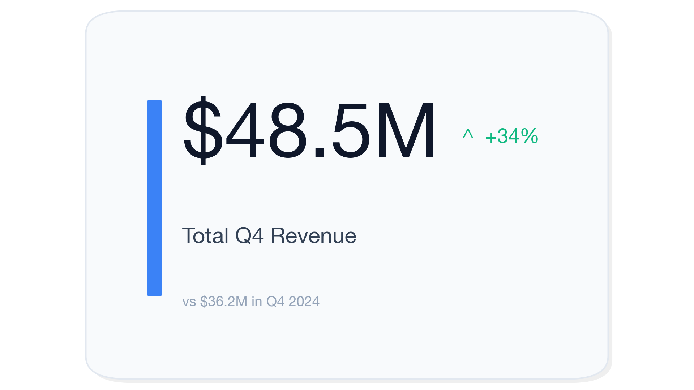
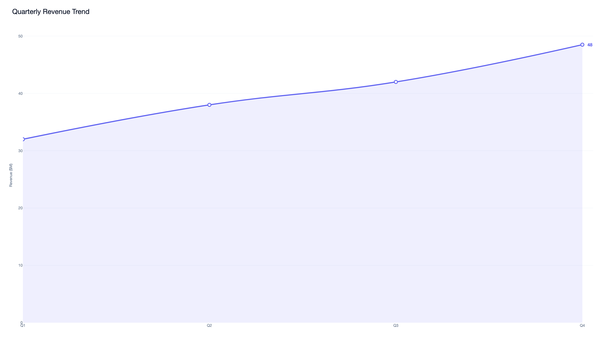
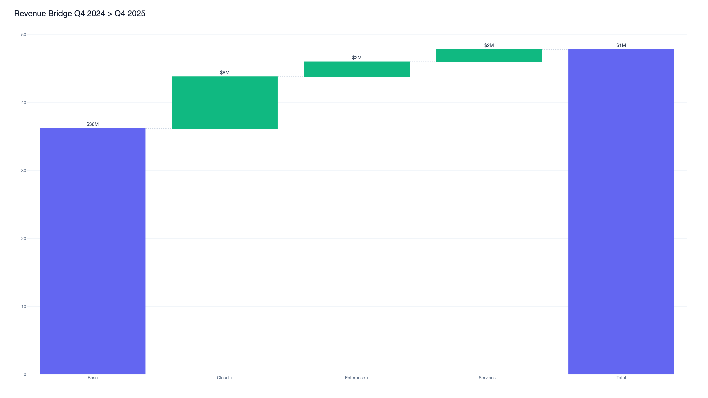
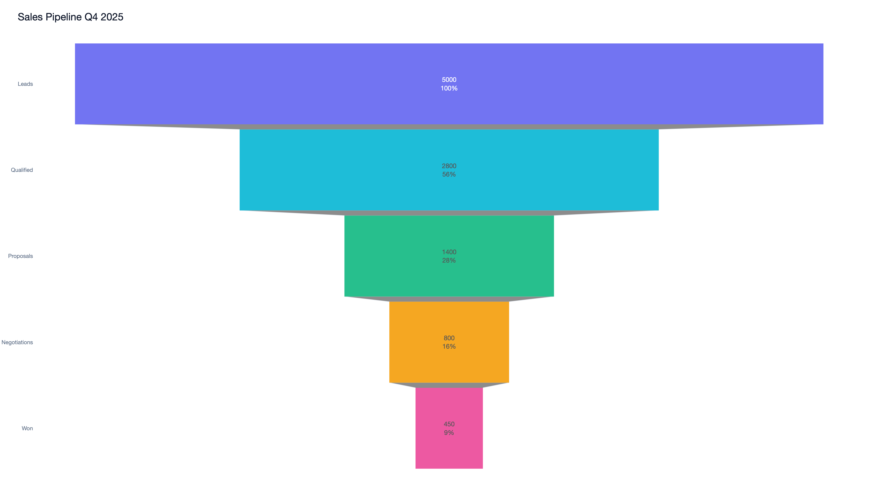

<br/>

<div align="center">

# ⚡ PitchCraft

**Turn your corporate PowerPoint template into an AI-powered presentation engine — upload your company template, add any context, and get fully branded slides in seconds.**

[](https://python.org)
[](https://fastapi.tiangolo.com)
[](https://react.dev)
[](https://typescriptlang.org)
[](https://openai.com)
[](LICENSE)

</div>

---

## What is PitchCraft?

PitchCraft is built for **companies that already have a corporate PowerPoint template** and want to generate fully branded, content-rich presentations automatically — without a designer and without manual slide work.

Upload your company `.pptx` template, add a PDF document (e.g. a quarterly report, product brief, or strategy paper) and a short prompt. PitchCraft uses GPT-4o to analyse the content, structure a narrative, select the right charts, and render everything directly into your corporate template — preserving your fonts, colors, section dividers, and slide layouts.

**The pipeline:**

```
Corporate Template (.pptx)  +  PDF / Prompt
          ↓
     GPT-4o (JSON slide structure)
          ↓
     Chart Engine (25+ chart types)
          ↓
     PPTX Generator (renders into your template)
          ↓
     Fully branded .pptx — ready to present
```

The AI detects and uses your template's **native slide layouts** — section dividers, two-column slides, statement/quote layouts — so the output looks like it was built by your in-house design team, not a generic tool.

### Features

#### AI Presentation Strategist
- Extracts real numeric data from uploaded PDFs and Markdown files
- Follows a mandatory narrative arc: **Context → Evidence → Insights → Actions**
- Enforces content density: every slide must have 3–4 substantive bullets or a real chart
- **Language detection:** German document → German slides. English document → English slides
- Asks targeted **clarifying questions** in the UI when context is missing or vague

#### Corporate Template — First-Class Support
- **Upload your own `.pptx`** company template — PitchCraft renders all slides directly into it
- Automatically detects and uses **native slide layouts** (section dividers, two-column, statement/quote, closing slides)
- Preserves your template's fonts, colors, logos, and watermarks — only the content is generated
- Also includes a built-in catalog of 20+ templates for teams without a custom template

#### 25+ Chart Types via Three Rendering Engines

| Engine | Charts |
|--------|--------|
| **Plotly** | bar, grouped_bar, stacked_bar, line, multi_line, area, pie/donut, scatter, waterfall, funnel, treemap, sunburst, heatmap, radar, slope |
| **Matplotlib** | KPI card, multi-KPI row, gauge, progress ring, icon-stat grid |
| **Altair** | box plot, histogram, density plot |

#### 14 Slide Layout Types
`title` · `agenda` · `section_header` · `content` · `chart` · `multi_chart` · `key_number` · `two_column` · `icon_grid` · `timeline` · `quote` · `metrics_grid` · `pricing` · `closing`

### Chart Engine Previews

<table>
  <tr>
    <td></td>
    <td></td>
    <td></td>
    <td></td>
  </tr>
  <tr>
    <td align="center">KPI Card</td>
    <td align="center">Bar Chart</td>
    <td align="center">Line Chart</td>
    <td align="center">Waterfall</td>
  </tr>
  <tr>
    <td></td>
    <td></td>
    <td></td>
    <td></td>
  </tr>
  <tr>
    <td align="center">Pie / Donut</td>
    <td align="center">Radar</td>
    <td align="center">Funnel</td>
    <td align="center">Heatmap</td>
  </tr>
</table>

### Tech Stack

#### Backend
| Component | Technology |
|-----------|-----------|
| API Framework | FastAPI + Uvicorn |
| AI Model | OpenAI GPT-4o (generation) + GPT-4o-mini (clarification check) |
| PPTX Engine | python-pptx |
| PDF Parsing | PyMuPDF (fitz) |
| Chart Rendering | Plotly/Kaleido · Matplotlib · Altair/vl-convert |
| Data Processing | Pandas · SciPy · Squarify |

#### Frontend
| Component | Technology |
|-----------|-----------|
| Framework | React 18 + TypeScript |
| Build Tool | Vite 6 |
| Styling | Tailwind CSS |
| Animations | Framer Motion |
| HTTP Client | Axios |
| Icons | Lucide React |

### Getting Started

**Prerequisites:** Python 3.11+, Node.js 18+, [OpenAI API key](https://platform.openai.com/api-keys)

```bash
# 1. Clone the repository
git clone https://github.com/Michael-me03/PitchCraft.git
cd PitchCraft

# 2. Set up the backend
cd backend
python3 -m venv .venv
source .venv/bin/activate   # Windows: .venv\Scripts\activate
pip install -r requirements.txt
echo "OPENAI_API_KEY=sk-..." > .env
uvicorn main:app --reload --port 8000

# 3. Set up the frontend (new terminal)
cd frontend
npm install
npm run dev
```

Frontend: `http://localhost:5173` · API docs: `http://localhost:8000/docs`

### API Reference

#### `GET /api/health`
```json
{ "status": "ok" }
```

#### `POST /api/clarify`
Check if context is sufficient; returns targeted questions if not.

**Request** (`multipart/form-data`): `user_prompt`, `purpose`, `pdf_file` (optional)

**Response:**
```json
{
  "needs_clarification": true,
  "questions": [
    { "id": "q1", "question": "...", "hint": "e.g. ..." }
  ]
}
```

#### `POST /api/generate`
Main generation endpoint.

**Request** (`multipart/form-data`):

| Field | Type | Description |
|-------|------|-------------|
| `template_id` | string | ID from `/api/templates` |
| `template_file` | file | Custom `.pptx` template upload |
| `user_prompt` | string | Free-text design instructions |
| `purpose` | string | `business` / `school` / `scientific` |
| `pdf_file` | file | Source document (`.pdf` or `.md`) |
| `clarifications` | string | JSON `{question: answer}` from clarify step |

**Response:** `{ "download_id": "...", "filename": "PitchCraft_...pptx" }`

#### `GET /api/download/{download_id}`
Download the generated PPTX. Files expire after 30 minutes.

### Project Structure

```
PitchCraft/
├── backend/
│   ├── main.py                    # FastAPI entry point & API endpoints
│   ├── models/schemas.py          # Pydantic models
│   └── services/
│       ├── ai_service.py          # GPT-4o prompt builder, generation & clarification
│       ├── chart_engine.py        # 25+ chart renderers (Plotly, Matplotlib, Altair)
│       ├── pdf_parser.py          # PyMuPDF text extraction
│       ├── pptx_generator.py      # Layout engine — 14 slide types, native template layouts
│       └── template_generator.py  # Template catalog & background injection
│
├── frontend/src/
│   ├── App.tsx                    # 3-step wizard with clarification flow
│   └── components/
│
├── test/                          # Chart previews, layout library, PPTX inspector
└── docs/screenshots/              # UI screenshots & chart previews
```

### Contributing

Pull requests are welcome. For major changes, please open an issue first.

### License

MIT — see [LICENSE](LICENSE) for details.

---
